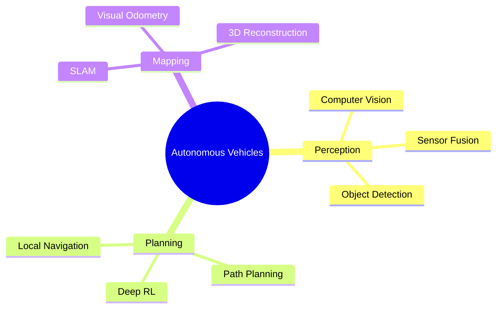

# Phan Thanh Danh (Oliver)

  
[)](https://git.io/typing-svg)

## 👨‍🎓 About Me

I'm a **Computer Engineering graduate student** at **Chungbuk National University** (South Korea) and researcher specializing in **Autonomous Vehicles**, **Computer Vision**, and **Robotics**. My research focuses on vision-based perception systems, sensor fusion, and deep reinforcement learning for autonomous navigation.

Previously studied at **Ho Chi Minh City University of Technology and Education (HCMUTE)**, where I was an active member of the **ISLab** research group.

### 🎯 Research Interests

- **Autonomous Vehicles**: Perception, planning, and control systems
- **Computer Vision**: Object detection, scene understanding, visual odometry
- **Sensor Fusion**: Multi-modal data integration for robust localization
- **Deep Learning**: Reinforcement learning for path planning and decision-making

---

## 📚 Recent Publications

### 2025

**Vision-Based Perception for Autonomous Vehicles in Obstacle Avoidance Scenarios**  
*CT Nguyen, DT Au, TD Phan, MT Duong, MH Le*  
📖 2025 17th International Conference on Human System Interaction (HSI), 1-7  
🔗 [arXiv:2507.12449](https://arxiv.org/abs/2507.12449)

**FusionGS-SLAM: Multiple Sensors Fusion for Localization and Real-Time Photorealistic Mapping**  
*TD Phan, GW Kim*  
📖 IEEE Robotics and Automation Letters, 2025

**Toward Specialized Learning-based Approaches for Visual Odometry: A Comprehensive Survey**  
*TD Phan, GW Kim*  
📖 Journal of Intelligent & Robotic Systems 111 (2), 1-32, 2025

**Perception and Deep Reinforcement Learning-Based Local Path Planner for Autonomous Vehicles**  
*TD Phan, GW Kim*  
📖 Journal of Korea Robotics Society 20 (2), 285-292, 2025

---

## 🛠️ Technical Skills

### Programming & Tools

### Frameworks & Libraries

### Hardware

---

## 🔬 Research Areas

---

## 📫 Connect With Me

**Chungbuk National University** | Computer Vision & Robotics Lab  
📧 Email verified at chungbuk.ac.kr

---

## 📊 GitHub Stats

  

---

### 💡 *"Building intelligent systems for a safer autonomous future"*

